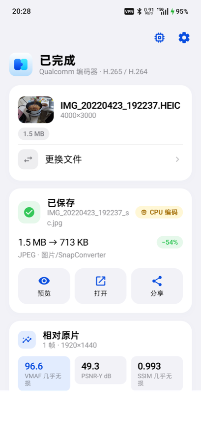
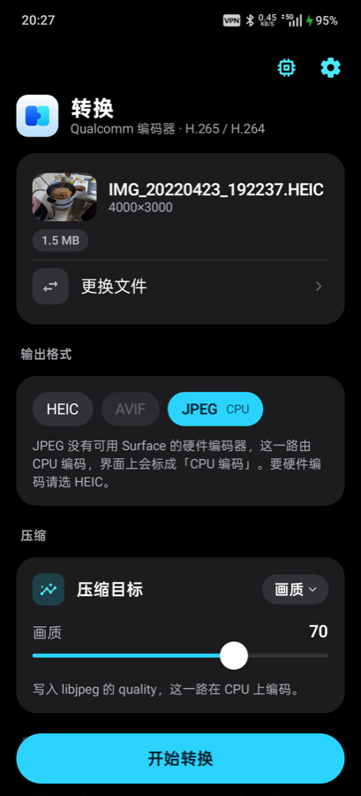
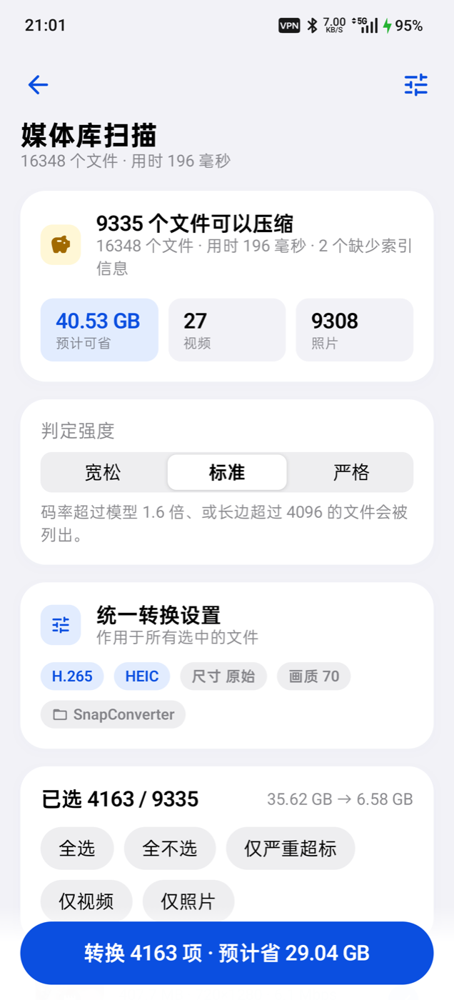
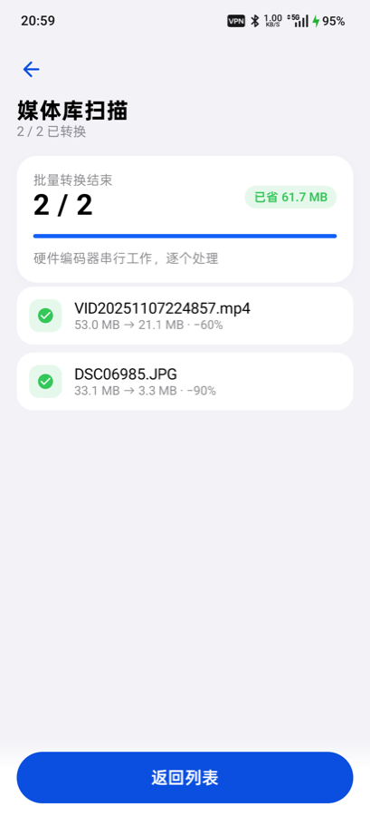

# SnapConverter

Hardware-first Android media converter for Snapdragon devices.

Decode and encode on the **video codec block**. Resize, rotate, and crop on **Adreno**. The CPU is the scheduler, not the codec.

```text
storage → Qualcomm HW decoder → Surface → OpenGL ES → encoder Surface → Qualcomm HW encoder → MP4 / HEIC
```

This is **not** an FFmpeg wrapper. It does not ship libx264, libx265, or libjpeg-turbo as the encode path.

## Why this shape

Android already exposes vendor video silicon through `MediaCodec` (`c2.qti.*` / `OMX.qcom.*`). Qualcomm documents MediaCodec vendor extensions (ROI, LTR, encoder statistics, QP) for Snapdragon. Putting frames into `Bitmap` / `ByteArray` throws that path away: YUV→RGB→resize→RGB→YUV on the CPU.

The correct path is the one Android documents for `MediaCodec.createInputSurface()`: render with OpenGL ES (or another hardware API) directly into the encoder.

Photos follow the same rule. V1’s still-image path is **HEIC via `HeifWriter` + a hardware HEVC encoder**, or **AVIF via `AvifWriter` + a hardware AV1 encoder** (capability-gated).

JPEG is the one declared exception: no Android device exposes a Surface-capable hardware JPEG encoder to apps, so JPEG is encoded on the CPU (`ImageDecoder.setTargetSize` → `Bitmap.compress` through libjpeg) and the UI labels every JPEG job **「CPU 编码」** — never “hardware”, never “Qualcomm”. The user picks JPEG knowing who encodes it; the CPU path is never used to rescue a failed hardware encode.

## V1 feature set

| | Input | Output |
| --- | --- | --- |
| Video | MP4, MOV | H.265 / H.264 MP4 |
| Image | JPEG, PNG, WebP, HEIC, AVIF (API 31+) | HEIC (HW HEVC still), AVIF (HW AV1 still), JPEG (CPU, labelled 「CPU 编码」) |

- Resolution: original, 2160p, 1440p, 1080p, 720p, or **custom W×H with aspect lock** (images, GPU resample)
- Frame rate: original, 60, 30, 24
- Modes: quality 0–100, target bitrate, target file size, target SSIM, target VMAF
- Trim: precise frame-accurate window re-encoded through the hardware pipeline (audio trimmed in sync)
- Audio extraction: passthrough copy to M4A via Extractor → Muxer (no codec, lossless)
- Mute: drop the audio track from the output
- Library scan: rank the whole media library by compressibility from MediaStore columns only (no file IO, ~16k files in a few hundred ms), with folder / date / sensitivity filters
- Batch conversion: convert the scan’s selection sequentially through the same hardware pipeline and the same pending → encode → commit output path
- Hardware: **Qualcomm MediaCodec only** for encode (no software fallback)
- GPU: OpenGL ES 3.x
- Audio: copied into the MP4, not re-encoded

Format availability is capability-driven: AVIF appears only when a hardware AV1 encoder enumerates. JPEG always appears and is always labelled as a CPU encode. TIFF is not offered: Android has no hardware TIFF encoder and the framework cannot even decode TIFF, so it could only exist as an undeclared CPU encode path — JPEG’s labelled exception does not extend to it.

AV1 video, HDR, ROI, and other-vendor SoCs are V2.

## Screens

Light, dark, and the library-scan flow (from a PJD110, in `docs/design/`):

| Home (light) | Home (dark) | Scan result | Batch run |
| --- | --- | --- | --- |
|  |  |  |  |

The UI follows the iOS 27 design language; the rules live in [AGENTS.md](AGENTS.md).

## Architecture

```text
                    Android App (Kotlin + Compose)
                                │
                        CompressionEngine
                     ┌──────────┴──────────┐
               Video Engine           Image Engine
                     │                     │
              MediaExtractor         ImageDecoder
                     │                     │
           Qualcomm HW decoder      GPU resize/crop
                     │                     │
              SurfaceTexture          Surface / YUV
                     │                     │
               Adreno GLES          HEIC  /  JPEG HW
                     │
          Encoder input Surface
                     │
           Qualcomm HW encoder
                     │
                 MediaMuxer
```

Three internal abstractions:

1. **`HardwareCodecSelector`** — enumerate `MediaCodecList`, require hardware + vendor, prefer Qualcomm, never `createEncoderByType()` as the source of truth.
2. **`GpuFrameProcessor`** — scale / rotate / crop on GLES, no per-frame Bitmap.
3. **`CompressionPolicy`** — map UI quality / target size / target bitrate to mime, resolution, fps, bitrate mode, QP.

Details: [`docs/ARCHITECTURE.md`](docs/ARCHITECTURE.md) and [`AGENTS.md`](AGENTS.md).

## Requirements

- Android 10 (API 29)+. Vendor extension probe uses API 31+.
- A Snapdragon device that exposes Qualcomm hardware codecs. Pixel / Exynos / Dimensity will currently fail closed with a capability error (by design).
- Android Studio or command-line SDK (`compileSdk` 36).

## Build

```bash
git clone https://github.com/caork/snapConverter.git
cd snapConverter
echo "sdk.dir=$ANDROID_HOME" > local.properties
./gradlew :engine:test :app:assembleDebug
```

Install on a device:

```bash
./gradlew :app:installDebug
```

## Encoder selection

```text
encoder
AND hardware accelerated
AND vendor
AND NOT software-only
AND name contains qti or qcom
AND NOT c2.android.* / OMX.google.*
→ MediaCodec.createByCodecName(name)
```

Typical Snapdragon names: `c2.qti.hevc.encoder`, `c2.qti.avc.encoder`, older `OMX.qcom.video.encoder.*`.

## Quality slider

The UI number `0..100` is not written straight into `MediaFormat.KEY_QUALITY`. Policy turns it into resolution, fps, bitrate or CQ, GOP, and optional vendor QP keys. If the encoder does not support CQ, SnapConverter uses VBR and a bitrate model.

## Status

This repository is the initial public implementation: project layout, hardware codec selector, GLES Surface pipeline, HEIC hardware still path, Compose UI, and capability probe. Treat on-device transcode as **early**. Device-specific Qualcomm behavior (CQ quality scale, vendor keys, HEVC still encode) must be verified on hardware.

## License

Apache License 2.0. See [LICENSE](LICENSE).

Snapdragon, Adreno, and Qualcomm are trademarks of their owners. This project is not affiliated with Qualcomm.
